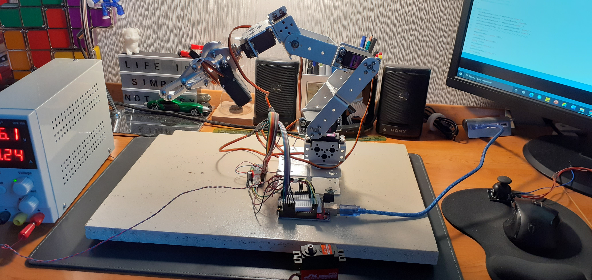
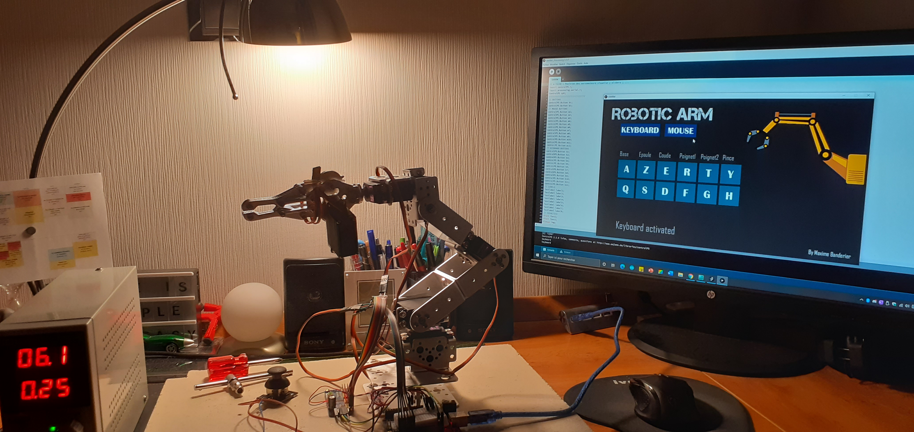
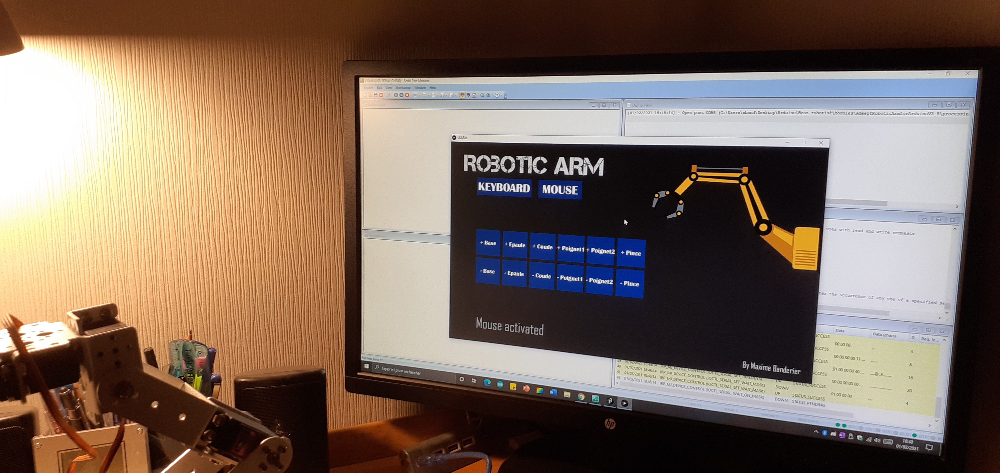
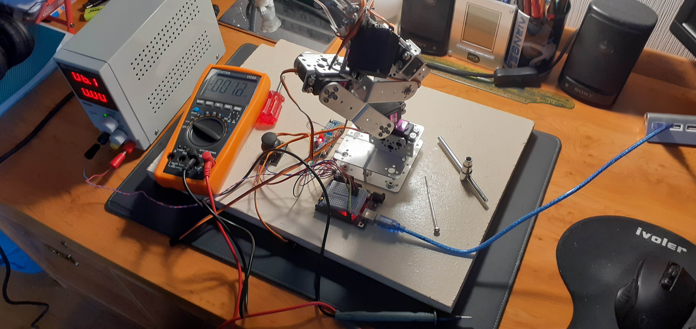

# 6dofarm

**Bras robotisé contrôlé par Arduino (programmé en C++ et piloté via port série avec une interface en C#)**

*Ce projet datant d'il y a plus de 5 ans, je ne dispose pas dans l'immédiat des codes correspondant puisqu'ils sont stockés sur un ancien disque dur qui est chez mes parents, mais je pourrais les récupérer dans les semaines à venir.*

